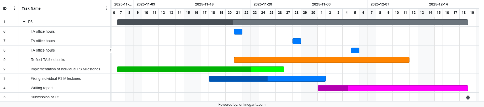

## Title: Comparison Navigation for Large Language Models and Humans

## Abstract 
Large language models (LLMs) excel at knowledge retrieval, but their ability to tackle structured navigation tasks like Wikipedia page navigation remains unclear. We evaluate LLMs under four paradigms (prompting strategies), including a novel strategy integrating external knowledge from knowledge graph developed in this study. Benchmarking on Wikispeedia dataset, we compare LLM and human navigation by success rate and other metrics. Our studies reveal that structured reasoning with these methods enables LLMs to achieve human-like or superior navigation performance to different extent. Stepwise analyses of semantic similarity and information gain show that LLMs initially explore broadly before converging to the target page, and specifically, the ToT strategy ensures steps remain semantically relevant and converges decisively on the appropriate category.

## Contributions
In our study, we provide a systematic comparison between humans and LLMs with modern prompting strategies. In addition to the commonly used strategies, we also develop a novel method enhanced by external graph and semantic knowledge. Furthermore, we explore and discuss the semantic progress and categorical shift of human and LLM-generated paths, enabling us to probe the nature of the reasoning of different agents.

## Methods
### Experimental Paradigms
**Simple zero-shot [blind]:** We ask the LLM to generate a path between the given start and destination. We don't include any checks whether the page exists in our dataset or the next page is a valid from the current one.

**Chain of thought [CoT]:** Here we generate the navigation path step by step, and in each prompt we include the possible outgoing links from the current page, making the LLM hallucinate less. Besides this we also use the Auto-CoT sentence: "Let's think step by step", as well as asking the LLM a rating for the next possible steps of which we ask 3. Based on the given rating we select the top 2 pages, and based on the ratings and the length of the paths so far, we decide the best path to go with.

**Chain of thought with external information [CoT(KB)]:** This is similar to the CoT prompt, the difference is that we also include some external information for each of the prompt. These information include the semantic similarity to the destination from each of the next possible pages, centrality difference between the destination and each of the next possible pages based on PageRank and the knowledge graph degrees for each of the next possible pages.

**Tree of thoughts [ToT]:** Similar to CoT, but instead of a single path, we explore a branching set of navigations. At each depth level we expand 2 candidates, thus, if the destination is not found after 4 steps/hops, we will have explored 2**4 candidate navigations. We only include the outgoing links in the prompt besides the current and destination pages.

### Evaluation Metrics

**Success Rate:** The success rate is defined by the proportion of LLM-generated paths in which the agent (human or LLM of a specific prompting strategy) successfully reach the target articles from the start page via a valid sequence of links. Invalid Links between two pages are checked.

**Mean Path Length:** Navigation efficiency is evaluated by the lengths of successful paths. For all successful paths, we compute the average number of steps to reach to goal across different agents. A shorter average path length may suggest the strategy used is more informative.

**Semantical Similarity:** Stepwise mean semantic similarity between consecutive article nodes along normalised navigation paths

**Categorical Shifts:** A categorical shift happens when a navigation step moves from one article to another while changing the category. We map each article to its primary category and count transitions along paths.

## Proposed timeline
### Gantt Chart

## Organization within the team
### Milestones:
Mark Hegedus:
- Zoomed in preprocessing analyses (top k start-destination pair distribution, information gain for the most common pair) [finsihed]
- Proof of concept implementation of an LLM ToT inference with simple BFS using heuristics rule [finsihed]
- Introduction of modularity regarding the code organization of the project [ongoing]
- Implement Microsoft Azure client besides Groq [P3-Milestone]
- Improve ToT in terms of token usage, and the heuristics rule [P3-Milestone]

Kris Kraack:
- Preprocessing and analysis for categories (finished and unfinished paths)
- Analysing categorical shifts along the human player navigation paths (finished paths). [finished]
- Readme contributions (Abstract, Contributions, and Methods sections) [finished]
- Analysing categorical shifts along the model navigation paths [P3-Milestone]
- Semantic analysis (cluster analysis, DRM) [P3-Milestone]

Ruiqi Zhang:
- Wikispeedia data proprocessing and exploration(Articles, Links, Paths, etc.) [finished]
- Article semantic visualization using sentence embeddings [finished]
- Writing the data story in the main.ipynb [finished]
- Implementing simple zero-shot I/O, few shots I/O (with human paths), and auto-CoT,and Knowledge graph incorporation (if possible) [P3-Milestone]
- Comparing the metrics between human and LLM [P3-Milestone]

## Appendix 
### Code organization:
#### Main logic:
- `main.ipynb`: Here we have the backbone of our project containing both markdown cells and code blocks. Markdowns tell a story of the whole project, while the code blocks demonstrate the results of our high-level methods, building up the project step by step.
#### Modules:
- `config_local.py`: The place where we can adjust the parameters of the whole analysis, from changing the saving folder of the embeddings to changing LLM API config parameters and many other things.
- `preprocessor.py`: This file has a `Preprocessor` class, which handles all the pandas related Dataframes, meaning that we have all of the filterings and aggregations in this single class.
- `visualizer.py`: This has a `Visualizer` class, which is responsible for all the visualizations done by matplotlib.
- `semantic.py`: Here we have a `SemanticAnalyser` class, where we collected all of the functionalities within semantic analysis such as generating embeddings for each of the pages or calculating a naive information gain based on the cosine similarities of the embeddings.
- `prompt.py`: `Prompt` is the high-level class residing in this file. Here we will have different prompts for all of the different prompting strategies (zero-shot I/O, few-shot I/O, auto-CoT, ToT). It also includes several `pydantic` models that define the expected structure of the LLM responses, making post-processing straightforward.
- `agent.py`:  `Agent` class interacts with the LLM client, for testing we have used Groq, but we tend to utilize Microsoft Azure service for the final project. Basically, we are creating the different prompts with the help of `Prompt` and then run the LLM inference as well as processing the LLM result based on the prompt strategy.
- `common.py`:  There is a single `IOMixin` class, which currently handles I/O.
#### Miscellaneous:
- `.env.example`: Example of the `.env` that is needed to run the main logic.
- `.gitignore`: Python specific thorough gitignore file.
- `.python-version`, `pyproject.toml`, `uv.lock`: uv project specific files, basically virtual environment definitions for uv.
- `requirements.txt`: A more general list of the packages needed for running the main logic.
#### Setting up environment:
- With `uv`:  `uv sync` and then you should be able to run the `main.ipynb`.
- With other python virtual environment manager: `pip install -r requirements.txt` and then you should be able to run the `main.ipynb`.
#### Naming convention:
- `def _method(self):` Internal methods within each of our modules, they are not called outside of the module.
- `def high_level_method(self):` High-level methods, we call them in our main logic.

### References:
- AI tools used for both code generation and conceptually ideas (Copilot/ChatGPT/DeepL).